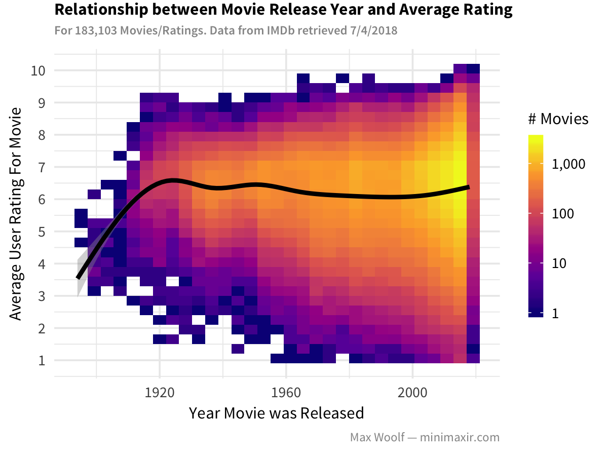

# imdb-data-analysis

R Code + R Notebook on how to process and visualize the official IMDb datasets.

This R Notebook is the complement to my blog post [Analyzing IMDb Data The Intended Way, with R and ggplot2](http://minimaxir.com/2018/07/imdb-data-analysis/).

## Maintainer
Max Woolf ([@minimaxir](http://minimaxir.com))

*Max's open-source projects are supported by his [Patreon](https://www.patreon.com/minimaxir). If you found this project helpful, any monetary contributions to the Patreon are appreciated and will be put to good creative use.*

## License
MIT