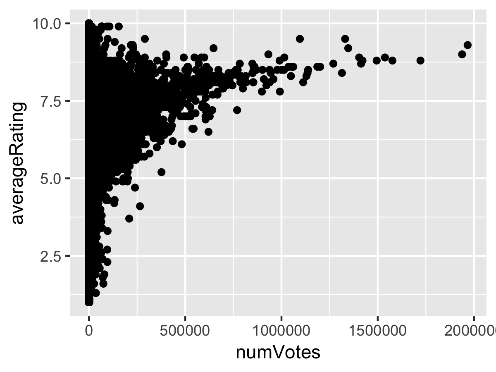
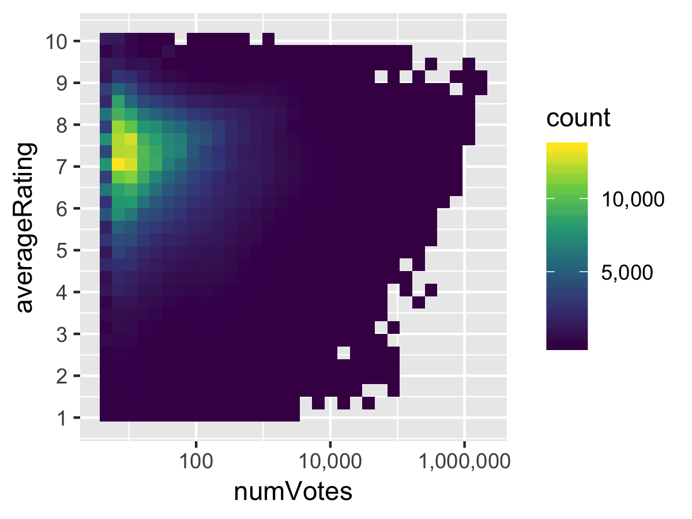

IMDb data retrieved on July 4th 2018.


**Information courtesy of
IMDb
(http://www.imdb.com).
Used with permission.**


```{r}
library(tidyverse)
library(ggridges)
library(tidytext)
library(scales)

sessionInfo()
```

Helper function to read IMDB files given filename.

```{r}
read_imdb <- function(data_path) {
  path <- "/Volumes/Extreme 510/Data/imdb/"
  read_tsv(paste0(path, data_path), na = "\\N", quote='', progress=F)
}
```


# Ratings

```{r}
df_ratings <- read_imdb("title.ratings.tsv")
df_ratings %>% head()
```


Plot every point. (note: very slow!)

```{r eval=FALSE}
plot <- ggplot(df_ratings, aes(x = numVotes, y = averageRating)) +
          geom_point()

ggsave("imdb-0.png", plot, width=4, height=3)
```



Plot a 2D histogram and clean up axes.

```{r}
plot <- ggplot(df_ratings, aes(x = numVotes, y = averageRating)) +
          geom_bin2d() +
          scale_x_log10(labels = comma) +
          scale_y_continuous(breaks = 1:10) +
          scale_fill_viridis_c()

ggsave("imdb-1.png", plot, width=4, height=3)
```




# Title Basics

```{r}
df_basics <- read_imdb("title.basics.tsv")
df_basics %>% head()
```

Merge `df_ratings` and `df_basics` to perform ratings/vote analysis using more metadata.

```{r}
df_ratings <- df_ratings %>% left_join(df_basics)

df_ratings %>% head()
```

```{r}
plot <- ggplot(df_ratings, aes(x = runtimeMinutes, y = averageRating)) +
          geom_bin2d() +
          scale_x_continuous(labels = comma) +
          scale_y_continuous(breaks = 1:10) +
          scale_fill_viridis_c()

ggsave("imdb-2a.png", plot, width=4, height=3)
```

Which movies have the superhigh runtimes?

```{r}
df_ratings %>% arrange(desc(runtimeMinutes)) %>% head(10)
```


```{r}
plot <- ggplot(df_ratings %>% filter(runtimeMinutes < 180, titleType=="movie", numVotes >= 10), aes(x = runtimeMinutes, y = averageRating)) +
          geom_bin2d() +
          scale_x_continuous(breaks = seq(0, 180, 60), labels = 0:3) +
          scale_y_continuous(breaks = 0:10) +
          scale_fill_viridis_c(option = "inferno", labels = comma) +
          theme_minimal(base_family = "Source Sans Pro", base_size=9) +
          labs(title="Relationship between Movie Runtime and Average Mobie Rating",
               subtitle="Data from IMDb retrieved July 4th, 2018",
               x="Runtime (Hours)",
               y="Average User Rating",
               caption="Max Woolf — minimaxir.com",
               fill="# Movies")

ggsave("imdb-2b.png", plot, width=6, height=3)
```

```{r}
df_ratings_unnest <- df_ratings %>%
                        filter(runtimeMinutes < 180, titleType=="movie", numVotes >= 10) %>%
                        select(runtimeMinutes, averageRating, genres) %>%
                        unnest_tokens(genre, genres, token = str_split, pattern = ",")

df_ratings_unnest %>% head(10)
```

```{r}
plot <- ggplot(df_ratings_unnest, aes(x = runtimeMinutes, y = averageRating)) +
          geom_bin2d() +
          scale_x_continuous(breaks = seq(0, 180, 60), labels = 0:3) +
          scale_y_continuous(breaks = 1:10) +
          scale_fill_viridis_c(option = "inferno", labels = comma) +
          theme_minimal(base_family = "Source Sans Pro", base_size=9) +
          labs(title="Relationship between Movie Runtime and Average Mobie Rating",
               subtitle="Data from IMDb retrieved July 4th, 2018",
               x="Runtime (Hours)",
               y="Average User Rating",
               caption="Max Woolf — minimaxir.com",
               fill="# Movies") +
          facet_wrap(~ genre)

ggsave("imdb-3.png", plot, width=6, height=6)
```

`squish` trick via https://stackoverflow.com/a/23655697/9314418

```{r}
df_temp <- df_ratings_unnest %>%
            filter(!(genre %in% c("game-show", "reality-tv", "short", "talk-show", NA))) %>%
            group_by(genre) %>%
            mutate(prop = 1/n())

plot <- ggplot(df_temp, aes(x = runtimeMinutes, y = averageRating, z=prop)) +
          stat_summary_2d(fun=sum) +
          scale_x_continuous(breaks = seq(0, 180, 60), labels = 0:3) +
          scale_y_continuous(breaks = 1:10) +
          scale_fill_viridis_c(option = "inferno", labels = comma, limits=c(0, 0.02), oob=squish, guide=F) +
          theme_minimal(base_family = "Source Sans Pro", base_size=9) +
          labs(title="Relationship between Movie Runtime and Average Mobie Rating",
               subtitle="Data from IMDb retrieved July 4th, 2018",
               x="Runtime (Hours)",
               y="Average User Rating",
               caption="Max Woolf — minimaxir.com") +
          facet_wrap(~ genre)

ggsave("imdb-3b.png", plot, width=6, height=6)
```


# Rating vs. Movie Year

```{r}
plot <- ggplot(df_ratings %>% filter(titleType=="movie"), aes(x = startYear, y = averageRating)) +
          geom_bin2d() +
          geom_smooth(color="black") +
          scale_x_continuous() +
          scale_y_continuous(breaks = 1:10) +
          scale_fill_viridis_c(option = "plasma", labels = comma, trans='log10') +
          theme_minimal(base_family = "Source Sans Pro", base_size=9)

ggsave("imdb-4.png", plot, width=6, height=3)
```

```{r}
plot <- ggplot(df_ratings %>% filter(startYear >= 2000, titleType=="movie",  numVotes >= 10) %>% mutate(startYear = factor(startYear)), aes(x = averageRating, y = startYear, fill=startYear)) +
          geom_density_ridges() +
          scale_fill_hue(guide=F) +
          scale_x_continuous(breaks = 1:10) +
          theme_minimal(base_family = "Source Sans Pro", base_size=9)

ggsave("imdb-5.png", plot, width=4, height=3)
```


```{r}
df_ratings_decades <- df_ratings %>%
                        filter(startYear>=1950, titleType=="movie",  numVotes >= 10) %>%
  mutate(decade = fct_rev(factor(cut_width(startYear, 10, boundary=0), labels = paste0(seq(1950, 2010, 10), "s"))))

df_ratings_decades %>% head()
```

```{r}
plot <- ggplot(df_ratings_decades, aes(x = averageRating, y = decade, fill=0.5 - abs(0.5-..ecdf..))) +
          geom_density_ridges_gradient(calc_ecdf=T, quantile_lines=T) +
          scale_fill_viridis_c(option = "plasma", guide=F) +
          scale_x_continuous(breaks = 1:10) +
          #scale_y_discrete(expand = c(0,01, 0)) +
          theme_minimal(base_family = "Source Sans Pro", base_size=9)

ggsave("imdb-6.png", plot, width=4, height=3)
```

```{r}
plot <- ggplot(df_ratings_decades, aes(x = runtimeMinutes, y = decade, fill=0.5 - abs(0.5-..ecdf..))) +
          geom_density_ridges_gradient(calc_ecdf=T, quantile_lines=T) +
          scale_fill_viridis_c(option = "plasma", guide=F) +
          scale_x_continuous(breaks = seq(0, 180, 60), limits=c(0,180), labels = 0:3) +
          theme_minimal(base_family = "Source Sans Pro", base_size=9)

ggsave("imdb-7.png", plot, width=4, height=3)
```

## Episode Analysis

For reference; not included in post.

```{r}
df_episode <- read_imdb("title.episode.tsv") %>% filter(!is.na(seasonNumber))
df_episode %>% head()
```

```{r}
df_episode_count <- df_episode %>%
                group_by(parentTconst, seasonNumber) %>%
                tally() %>%
                left_join(df_basics,  c("parentTconst" = "tconst"))

df_episode_count %>% head()
```

Too much bad data to clean.


## Actor Information


```{r}
df_actors <- read_imdb("name.basics.tsv") %>%
                filter(str_detect(primaryProfession,"actor|actress"))  %>%
                select(nconst, primaryName,  birthYear)

df_actors %>% head()
```

```{r}
df_principals <- read_imdb("title.principals.tsv") %>%
  filter(str_detect(category, "actor|actress")) %>%
  select(tconst, ordering, nconst, category) %>%
  group_by(tconst) %>%
  filter(ordering == min(ordering))

df_principals %>% head()
```

Join the 2 dataframes.  (onto `principals`, since Many-to-One)

```{r}
df_principals <- df_principals %>% left_join(df_actors)

df_principals %>% head()
```

# Putting It All Together

Merge actor information onto the full ratings dataframe.

```{r}
df_ratings <- df_ratings %>% left_join(df_principals)

df_ratings %>% head()
```

Filter down to movies w/ actor info. (only if the birth year is present in the data)

```{r}
df_ratings_movies <- df_ratings %>%
                        filter(titleType == "movie", !is.na(birthYear)) %>%
                        mutate(age_lead = startYear - birthYear) %>%
                        arrange(desc(numVotes))

df_ratings_movies %>% head(100)
```

Aggregate lead-actor/actress ages by movie year w/ percentiles.

```{r}
df_actor_ages <- df_ratings_movies %>%
                  group_by(startYear) %>%
                  summarize(low_age = quantile(age_lead, 0.25, na.rm=T),
                            med_age = quantile(age_lead, 0.50, na.rm=T),
                            high_age = quantile(age_lead, 0.75, na.rm=T)) %>%
                  arrange(startYear)

df_actor_ages %>% head()
```

Create a ribbon plot.

NB: Plot the ribbon before the line.

```{r}
plot <- ggplot(df_actor_ages %>% filter(startYear >= 1920) , aes(x = startYear)) +
          geom_ribbon(aes(ymin=low_age, ymax=high_age), alpha=0.2) +
          geom_line(aes(y=med_age)) +
          theme_minimal(base_family = "Source Sans Pro", base_size=9)

ggsave("imdb-8.png", plot, width=4, height=3)
```

Create a plot comparing actors/actresses. Same code, except adding an aggregation and aestetic on `category`.

```{r}
df_actor_ages <- df_ratings_movies %>%
                  group_by(startYear, category) %>%
                  summarize(low_age = quantile(age_lead, 0.25, na.rm=T),
                            med_age = quantile(age_lead, 0.50, na.rm=T),
                            high_age = quantile(age_lead, 0.75, na.rm=T)) %>%
                  arrange(startYear)

df_actor_ages %>% head()

plot <- ggplot(df_actor_ages %>% filter(startYear >= 1920), aes(x = startYear, fill=category, color=category)) +
          geom_ribbon(aes(ymin=low_age, ymax=high_age), alpha=0.2, size=0) +
          geom_line(aes(y=med_age)) +
          theme_minimal(base_family = "Source Sans Pro", base_size=9) +
          scale_fill_brewer(palette="Set1") +
          scale_color_brewer(palette="Set1")

ggsave("imdb-9.png", plot, width=4, height=3)
```

Same plot, but facet.

```{r}
df_actor_ages <- df_ratings_movies %>%
                  select(startYear, category, genres, age_lead) %>%
                  unnest_tokens(genre, genres, token = str_split, pattern = ",") %>%
                  filter(!(genre %in% c("game-show", "reality-tv", "short", "talk-show", NA))) %>%
                  group_by(startYear, category, genre) %>%
                  summarize(low_age = quantile(age_lead, 0.25, na.rm=T),
                            med_age = quantile(age_lead, 0.50, na.rm=T),
                            high_age = quantile(age_lead, 0.75, na.rm=T)) %>%
                  arrange(startYear)

df_actor_ages %>% head()

plot <- ggplot(df_actor_ages %>% filter(startYear >= 1950), aes(x = startYear, fill=category, color=category)) +
          geom_ribbon(aes(ymin=low_age, ymax=high_age), alpha=0.2, size=0) +
          geom_line(aes(y=med_age), size=0.5) +
          theme_minimal(base_family = "Source Sans Pro", base_size=9) +
          scale_fill_brewer(palette="Set1") +
          scale_color_brewer(palette="Set1") +
          facet_wrap(~ genre)

ggsave("imdb-10.png", plot, width=6, height=6)
```

Unused in post since similar accross all genres.

# Lead Balance

```{r}
plot <- ggplot(df_ratings_movies %>% filter(startYear >= 1950), aes(x = startYear, fill=category)) +
          geom_bar(position="fill") +
          theme_minimal(base_family = "Source Sans Pro", base_size=9) +
          scale_fill_brewer(palette="Set1") +
          scale_color_brewer(palette="Set1")

ggsave("imdb-11.png", plot, width=4, height=3)
```

# nth time lead

```{r}
df_ratings_movies_nth <- df_ratings_movies %>%
                      group_by(nconst) %>%
                      arrange(startYear) %>%
                      mutate(nth_lead = row_number()) %>%
                      #filter(nth_lead <= 50) %>%
                      ungroup() %>%
                      arrange(desc(startYear), desc(numVotes))

df_ratings_movies_nth %>% select(primaryTitle, primaryName, nth_lead) %>% head(100)
```

```{r}
df_actor_ages <- df_ratings_movies_nth %>%
                  group_by(startYear) %>%
                  summarize(low_age = quantile(nth_lead, 0.25),
                            med_age = quantile(nth_lead, 0.50),
                            high_age = quantile(nth_lead, 0.75)) %>%
                  arrange(startYear)

df_actor_ages %>% head()

plot <- ggplot(df_actor_ages %>% filter(startYear >= 1950) , aes(x = startYear)) +
          geom_ribbon(aes(ymin=low_age, ymax=high_age), alpha=0.2) +
          geom_line(aes(y=med_age)) +
          theme_minimal(base_family = "Source Sans Pro", base_size=9)

ggsave("imdb-12.png", plot, width=4, height=3)
```