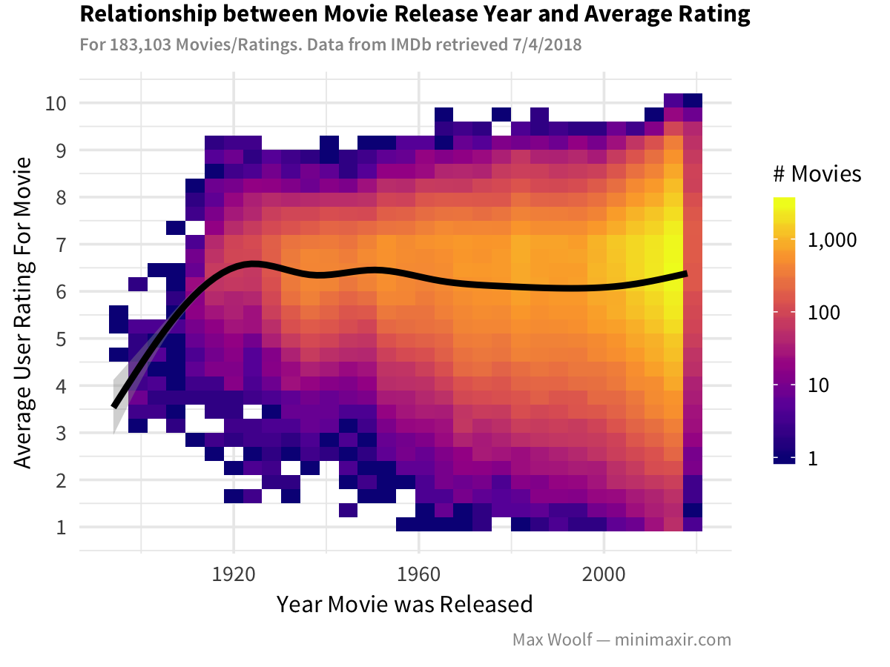

This notebook is licensed under the MIT License. If you use the code or data visualization designs contained within this notebook, it would be greatly appreciated if proper attribution is given back to this notebook and/or myself. Thanks! :)

IMDb data retrieved on July 4th 2018.


**Information courtesy of
IMDb
(http://www.imdb.com).
Used with permission.**


```{r}
library(tidyverse)
library(ggridges)   # unused in final blog post
library(tidytext)   # unused in final blog post
library(scales)

sessionInfo()
```

Helper function to read IMDB files given filename.

```{r}
read_imdb <- function(data_path) {
  path <- "/Volumes/Extreme 510/Data/imdb/"
  read_tsv(paste0(path, data_path), na = "\\N", quote='', progress=F)
}
```

Helper function to pretty print the size of a dataframe for charts/notebook.

```{r}
ppdf <- function(df) {
  df %>% nrow() %>% comma()
}
```


# Ratings

```{r}
df_ratings <- read_imdb("title.ratings.tsv")
df_ratings %>% head()
```

There are **`r df_ratings %>% ppdf()`** ratings in the dataset.

Plot every point. (note: very slow!)

```{r eval=FALSE}
plot <- ggplot(df_ratings, aes(x = numVotes, y = averageRating)) +
          geom_point()

ggsave("imdb-0.png", plot, width=4, height=3)
```


Plot a 2D histogram and clean up axes.

```{r}
plot <- ggplot(df_ratings, aes(x = numVotes, y = averageRating)) +
          geom_bin2d() +
          scale_x_log10(labels = comma) +
          scale_y_continuous(breaks = 1:10) +
          scale_fill_viridis_c(labels = comma)

ggsave("imdb-1.png", plot, width=4, height=3)
```


# Title Basics

```{r}
df_basics <- read_imdb("title.basics.tsv")
df_basics %>% head()
```

There are **`r df_basics %>% ppdf()`** titles in the dataset.

Merge `df_ratings` and `df_basics` to perform ratings/vote analysis using more metadata.

```{r}
df_ratings <- df_ratings %>% left_join(df_basics)

df_ratings %>% head()
```

```{r}
plot <- ggplot(df_ratings, aes(x = runtimeMinutes, y = averageRating)) +
          geom_bin2d() +
          scale_x_continuous(labels = comma) +
          scale_y_continuous(breaks = 1:10) +
          scale_fill_viridis_c()

ggsave("imdb-2a.png", plot, width=4, height=3)
```


Which movies have the superhigh runtimes?

```{r}
df_ratings %>% arrange(desc(runtimeMinutes)) %>% head(10)
```


```{r}
plot <- ggplot(df_ratings %>% filter(runtimeMinutes < 180, titleType=="movie", numVotes >= 10), aes(x = runtimeMinutes, y = averageRating)) +
          geom_bin2d() +
          scale_x_continuous(breaks = seq(0, 180, 60), labels = 0:3) +
          scale_y_continuous(breaks = 0:10) +
          scale_fill_viridis_c(option = "inferno", labels = comma) +
          theme_minimal(base_family = "Source Sans Pro", base_size=8) +
          labs(title="Relationship between Movie Runtime and Average Movie Rating",
               subtitle="Data from IMDb retrieved July 4th, 2018",
               x="Runtime (Hours)",
               y="Average User Rating",
               caption="Max Woolf — minimaxir.com",
               fill="# Movies")

ggsave("imdb-2b.png", plot, width=4, height=3)
```


## Unnesting Genres

How to facet by genre; this was removed from the post since a little complicated.

NB: you cannot use default tokenization on `unnest_tokens` since some tokens have dashes. (e.g. `film-noir`)

```{r}
df_ratings_unnest <- df_ratings %>%
                        filter(runtimeMinutes < 180, titleType=="movie", numVotes >= 10) %>%
                        select(runtimeMinutes, averageRating, genres) %>%
                        unnest_tokens(genre, genres, token = str_split, pattern = ",")

df_ratings_unnest %>% head(10)
```

```{r}
plot <- ggplot(df_ratings_unnest, aes(x = runtimeMinutes, y = averageRating)) +
          geom_bin2d() +
          scale_x_continuous(breaks = seq(0, 180, 60), labels = 0:3) +
          scale_y_continuous(breaks = 1:10) +
          scale_fill_viridis_c(option = "inferno", labels = comma) +
          theme_minimal(base_family = "Source Sans Pro", base_size=9) +
          labs(title="Relationship between Movie Runtime and Average Mobie Rating",
               subtitle="Data from IMDb retrieved July 4th, 2018",
               x="Runtime (Hours)",
               y="Average User Rating",
               caption="Max Woolf — minimaxir.com",
               fill="# Movies") +
          facet_wrap(~ genre)

ggsave("imdb-3.png", plot, width=6, height=6)
```

Normalize by facet. There are two approaches:

1. Do a weighted sum of the points in the spatial area, where the weight is the reciprocol of the # of points in the facet.
2. Manually calculate bins/counts and scale to `[0, 1]`

Option 1 is a bit easier to implement. Additionally, remove facets with little data.

`squish` trick via https://stackoverflow.com/a/23655697/9314418

```{r}
df_temp <- df_ratings_unnest %>%
            filter(!(genre %in% c("game-show", "reality-tv", "short", "talk-show", NA))) %>%
            group_by(genre) %>%
            mutate(prop = 1/n())

plot <- ggplot(df_temp, aes(x = runtimeMinutes, y = averageRating, z=prop)) +
          stat_summary_2d(fun=sum) +
          scale_x_continuous(breaks = seq(0, 180, 60), labels = 0:3) +
          scale_y_continuous(breaks = 1:10) +
          scale_fill_viridis_c(option = "inferno", labels = comma, limits=c(0, 0.02), oob=squish, guide=F) +
          theme_minimal(base_family = "Source Sans Pro", base_size=9) +
          labs(title="Relationship between Movie Runtime and Average Mobie Rating",
               subtitle="Data from IMDb retrieved July 4th, 2018",
               x="Runtime (Hours)",
               y="Average User Rating",
               caption="Max Woolf — minimaxir.com") +
          facet_wrap(~ genre)

ggsave("imdb-3b.png", plot, width=6, height=6)
```


# Rating vs. Movie Year

Set theme to custom theme based on `theme_minimal` for the rest of the notebook.

```{r}
theme_set(theme_minimal(base_size=9, base_family="Source Sans Pro") +
            theme(plot.title = element_text(size=8, family="Source Sans Pro Bold", margin=margin(t = -0.1, b = 0.1, unit='cm')),
                  axis.title.x = element_text(size=8),
                  axis.title.y = element_text(size=8),
                  plot.subtitle = element_text(family="Source Sans Pro Semibold", color="#969696", size=6),
                  plot.caption = element_text(size=6, color="#969696"),
                  legend.title = element_text(size=8),
                  legend.key.width = unit(0.25, unit='cm')))
```


```{r}
plot <- ggplot(df_ratings %>% filter(titleType=="movie", numVotes >= 10), aes(x = startYear, y = averageRating)) +
          geom_bin2d() +
          geom_smooth(color="black") +
          scale_x_continuous() +
          scale_y_continuous(breaks = 1:10) +
          scale_fill_viridis_c(option = "plasma", labels = comma, trans='log10') +
          labs(title="Relationship between Movie Release Year and Average Rating",
               subtitle=sprintf("For %s Movies/Ratings. Data from IMDb retrieved 7/4/2018", df_ratings %>% filter(titleType=="movie", numVotes >= 10) %>% ppdf),
               x="Year Movie was Released",
               y="Average User Rating For Movie",
               caption="Max Woolf — minimaxir.com",
               fill="# Movies")

ggsave("imdb-4.png", plot, width=4, height=3)
```



Work with Ridge plots; not included in post because it doesn't offer much insight different from the chart above.

NB: For ridge plots, the y-axis must be a `factor`, not a `numeric`; this is what tripped me up in the stream.

```{r}
plot <- ggplot(df_ratings %>% filter(startYear >= 2000, titleType=="movie",  numVotes >= 10) %>% mutate(startYear = factor(startYear)), aes(x = averageRating, y = startYear, fill=startYear)) +
          geom_density_ridges() +
          scale_fill_hue(guide=F) +
          scale_x_continuous(breaks = 1:10) +
          theme_minimal(base_family = "Source Sans Pro", base_size=9)

ggsave("imdb-5.png", plot, width=4, height=3)
```


Bucket by decades.

```{r}
df_ratings_decades <- df_ratings %>%
                        filter(startYear>=1950, titleType=="movie",  numVotes >= 10) %>%
  mutate(decade = fct_rev(factor(cut_width(startYear, 10, boundary=0), labels = paste0(seq(1950, 2010, 10), "s"))))

df_ratings_decades %>% head()
```

```{r}
plot <- ggplot(df_ratings_decades, aes(x = averageRating, y = decade, fill=0.5 - abs(0.5-..ecdf..))) +
          geom_density_ridges_gradient(calc_ecdf=T, quantile_lines=T) +
          scale_fill_viridis_c(option = "plasma", guide=F) +
          scale_x_continuous(breaks = 1:10) +
          #scale_y_discrete(expand = c(0,01, 0)) +
          theme_minimal(base_family = "Source Sans Pro", base_size=9)

ggsave("imdb-6.png", plot, width=4, height=3)
```


```{r}
plot <- ggplot(df_ratings_decades, aes(x = runtimeMinutes, y = decade, fill=0.5 - abs(0.5-..ecdf..))) +
          geom_density_ridges_gradient(calc_ecdf=T, quantile_lines=T) +
          scale_fill_viridis_c(option = "plasma", guide=F) +
          scale_x_continuous(breaks = seq(0, 180, 60), limits=c(0,180), labels = 0:3) +
          theme_minimal(base_family = "Source Sans Pro", base_size=9)

ggsave("imdb-7.png", plot, width=4, height=3)
```


## Episode Analysis

For reference; not included in post. (Too much bad data to clean.)

```{r}
df_episode <- read_imdb("title.episode.tsv") %>% filter(!is.na(seasonNumber))
df_episode %>% head()
```

There are `r df_episode %>% ppdf()` episodes in the dataset.

```{r}
df_episode_count <- df_episode %>%
                group_by(parentTconst, seasonNumber) %>%
                tally() %>%
                left_join(df_basics,  c("parentTconst" = "tconst"))

df_episode_count %>% head()
```


# Actor Information

`str_detect` is vectorized and *much* faster than using a loop/`lapply`. Using a regular expression to search for actor *or* actress is another speed increase.

```{r}
df_actors <- read_imdb("name.basics.tsv") %>%
                filter(str_detect(primaryProfession, "actor|actress"))  %>%
                select(nconst, primaryName,  birthYear)

df_actors %>% head()
```

There are **`r df_actors %>% ppdf()`** actors in the dataset.

```{r}
df_principals <- read_imdb("title.principals.tsv") %>%
  filter(str_detect(category, "actor|actress")) %>%
  select(tconst, ordering, nconst, category) %>%
  group_by(tconst) %>%
  filter(ordering == min(ordering))

df_principals %>% head()
```

There are **`r df_principals %>% ppdf()`** principals/rows in the dataset.

Join the 2 dataframes.  (onto `principals`, since Many-to-One)

```{r}
df_principals <- df_principals %>% left_join(df_actors)

df_principals %>% head()
```

# Putting It All Together

Merge actor information onto the full ratings dataframe.

```{r}
df_ratings <- df_ratings %>% left_join(df_principals)

df_ratings %>% head()
```

Filter down to movies w/ actor info. (only if the birth year is present in the data)

```{r}
df_ratings_movies <- df_ratings %>%
                        filter(titleType == "movie", !is.na(birthYear), numVotes >= 10) %>%
                        mutate(age_lead = startYear - birthYear) %>%
                        arrange(desc(numVotes))

df_ratings_movies %>% head(100)
```

Aggregate lead-actor/actress ages by movie year w/ percentiles.

```{r}
df_actor_ages <- df_ratings_movies %>%
                  group_by(startYear) %>%
                  summarize(low_age = quantile(age_lead, 0.25, na.rm=T),
                            med_age = quantile(age_lead, 0.50, na.rm=T),
                            high_age = quantile(age_lead, 0.75, na.rm=T)) %>%
                  arrange(startYear)

df_actor_ages %>% head()
```

Create a ribbon plot.

NB: Plot the ribbon before the line, so the line is on top.

```{r}
plot <- ggplot(df_actor_ages %>% filter(startYear >= 1920) , aes(x = startYear)) +
          geom_ribbon(aes(ymin=low_age, ymax=high_age), alpha=0.2) +
          geom_line(aes(y=med_age)) +
          labs(title="Change in Ages of Movie Lead Actors/Actress Over Time",
               subtitle=sprintf("For %s Actors. Line represents median age.\nRibbon bounds represent 25th — 75th Percentiles. Data from IMDb retrieved 7/4/2018",df_ratings_movies %>% filter(startYear >= 1920) %>% ppdf()),
               x="Year Movie was Released",
               y="Age of Lead Actor/Actress",
               caption="Max Woolf — minimaxir.com",
               fill="# Movies")

ggsave("imdb-8.png", plot, width=4, height=3)
```


Create a plot comparing actors/actresses. Same code, except adding an aggregation and aestetic on `category`.

```{r}
df_actor_ages_lead <- df_ratings_movies %>%
                  group_by(startYear, category) %>%
                  summarize(low_age = quantile(age_lead, 0.25, na.rm=T),
                            med_age = quantile(age_lead, 0.50, na.rm=T),
                            high_age = quantile(age_lead, 0.75, na.rm=T)) %>%
                  arrange(startYear)

df_actor_ages_lead %>% head()

plot <- ggplot(df_actor_ages_lead %>% filter(startYear >= 1920), aes(x = startYear, fill=category, color=category)) +
          geom_ribbon(aes(ymin=low_age, ymax=high_age), alpha=0.2, size=0) +
          geom_line(aes(y=med_age)) +
          scale_fill_brewer(palette="Set1") +
          scale_color_brewer(palette="Set1") +
          labs(title="Change in Ages of Movie Lead Actors/Actress Over Time",
               subtitle=sprintf("For %s Actors. Line represents median age.\nRibbon bounds represent 25th — 75th Percentiles. Data from IMDb retrieved 7/4/2018",df_ratings_movies %>% filter(startYear >= 1920) %>% ppdf()),
               x="Year Movie was Released",
               y="Age of Lead Actor/Actress",
               caption="Max Woolf — minimaxir.com",
               fill='',
               color='')

ggsave("imdb-9.png", plot, width=4, height=3)
```


Same plot, but facet. (unused in final post since may not be enough data/similar accross all genres)

```{r}
df_actor_ages_lead <- df_ratings_movies %>%
                  select(startYear, category, genres, age_lead) %>%
                  unnest_tokens(genre, genres, token = str_split, pattern = ",") %>%
                  filter(!(genre %in% c("game-show", "reality-tv", "short", "talk-show", "film-noir", NA))) %>%
                  group_by(startYear, category, genre) %>%
                  summarize(low_age = quantile(age_lead, 0.25, na.rm=T),
                            med_age = quantile(age_lead, 0.50, na.rm=T),
                            high_age = quantile(age_lead, 0.75, na.rm=T)) %>%
                  arrange(startYear)

df_actor_ages_lead %>% head()

plot <- ggplot(df_actor_ages_lead %>% filter(startYear >= 1950), aes(x = startYear, fill=category, color=category)) +
          geom_ribbon(aes(ymin=low_age, ymax=high_age), alpha=0.2, size=0) +
          geom_line(aes(y=med_age), size=0.5) +
          theme_minimal(base_family = "Source Sans Pro", base_size=9) +
          scale_fill_brewer(palette="Set1") +
          scale_color_brewer(palette="Set1") +
          facet_wrap(~ genre)

ggsave("imdb-10.png", plot, width=6, height=6)
```


# Lead Gender Balance

Unused in post since a bit more complicated to explain and results need double-checking.

```{r}
plot <- ggplot(df_ratings_movies %>% filter(startYear >= 1950), aes(x = startYear, fill=category)) +
          geom_bar(position="fill", width=1) +
          theme_minimal(base_family = "Source Sans Pro", base_size=9) +
          scale_fill_brewer(palette="Set1") +
          scale_color_brewer(palette="Set1")

ggsave("imdb-11.png", plot, width=4, height=3)
```


# nth time lead

```{r}
df_ratings_movies_nth <- df_ratings_movies %>%
                      group_by(nconst) %>%
                      arrange(startYear) %>%
                      mutate(nth_lead = row_number()) %>%
                      #filter(nth_lead <= 50) %>%
                      ungroup() %>%
                      arrange(desc(startYear), desc(numVotes))

df_ratings_movies_nth %>% select(primaryTitle, primaryName, nth_lead) %>% head(100)
```

```{r}
df_actor_ages <- df_ratings_movies_nth %>%
                  group_by(startYear) %>%
                  summarize(low_nth = quantile(nth_lead, 0.25),
                            med_nth = quantile(nth_lead, 0.50),
                            high_nth = quantile(nth_lead, 0.75)) %>%
                  arrange(startYear)

df_actor_ages %>% head()

plot <- ggplot(df_actor_ages %>% filter(startYear >= 1950) , aes(x = startYear)) +
          geom_ribbon(aes(ymin=low_nth, ymax=high_nth), alpha=0.2) +
          geom_line(aes(y=med_nth)) +
          scale_y_continuous(breaks=c(1:5, 10)) +
          labs(title="#th Time Lead Actor of Movie Was A Lead Actor, Over Time",
               subtitle=sprintf("For %s Lead Actors. Line represents median #.\nRibbon bounds represent 25th — 75th Percentiles. Data from IMDb retrieved 7/4/2018",df_ratings_movies_nth %>% filter(startYear >= 1950) %>% ppdf()),
               x="Year",
               y="#th Time Lead Actor was a Lead Actor",
               caption="Max Woolf — minimaxir.com",
               fill="# Movies") +
          theme(panel.grid.minor = element_blank())

ggsave("imdb-12.png", plot, width=4, height=3)
```


# LICENSE

The MIT License (MIT)

Copyright (c) 2018 Max Woolf

Permission is hereby granted, free of charge, to any person obtaining a copy of this software and associated documentation files (the "Software"), to deal in the Software without restriction, including without limitation the rights to use, copy, modify, merge, publish, distribute, sublicense, and/or sell copies of the Software, and to permit persons to whom the Software is furnished to do so, subject to the following conditions:

The above copyright notice and this permission notice shall be included in all copies or substantial portions of the Software.

THE SOFTWARE IS PROVIDED "AS IS", WITHOUT WARRANTY OF ANY KIND, EXPRESS OR IMPLIED, INCLUDING BUT NOT LIMITED TO THE WARRANTIES OF MERCHANTABILITY, FITNESS FOR A PARTICULAR PURPOSE AND NONINFRINGEMENT. IN NO EVENT SHALL THE AUTHORS OR COPYRIGHT HOLDERS BE LIABLE FOR ANY CLAIM, DAMAGES OR OTHER LIABILITY, WHETHER IN AN ACTION OF CONTRACT, TORT OR OTHERWISE, ARISING FROM, OUT OF OR IN CONNECTION WITH THE SOFTWARE OR THE USE OR OTHER DEALINGS IN THE SOFTWARE.